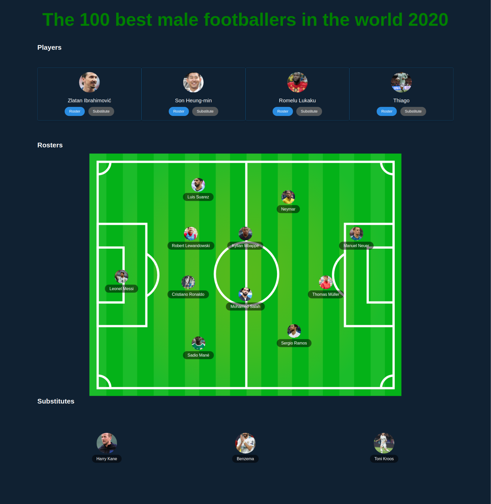

# The 100 best male footballers in the world 2020

## Description

ED Manager is an application to manage the football roster list.

## Usage

You have a pre-listed football players who could be selected to the roster list or substitute list.
When you have the roster list on the field you can remove them to add to pre-listed players, also for substitute players.

## How to run

ED Manager is a React application for that you can up it on development mode: `npm start`

or

create a production environment: `npm  build`